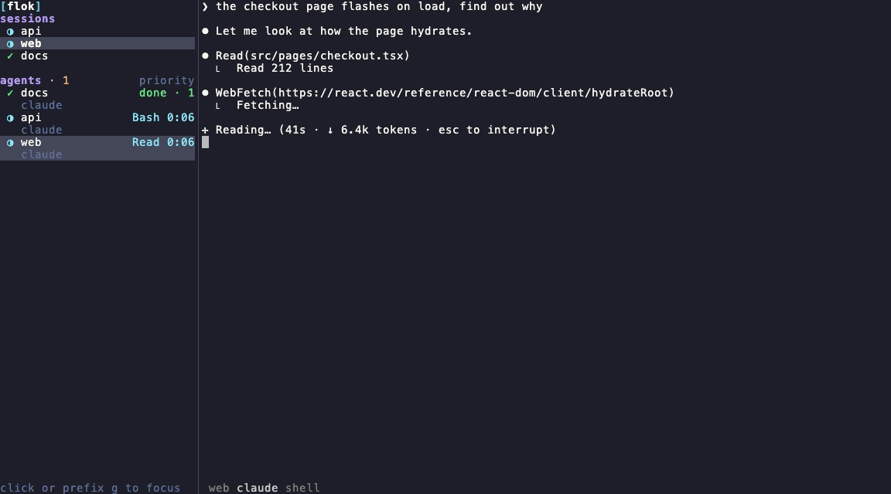
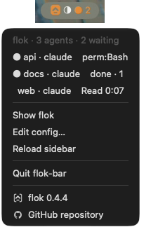

<p align="center"></p>

[](https://github.com/w4jnl/flok/actions/workflows/ci.yml)

See every Claude Code and Copilot CLI session in your tmux, which one is waiting on you, and jump
there. Your tmux server, config and plugins stay untouched.

flok is a narrow sidebar pane next to your normal tmux: sessions on top, agents below, a sound
when an agent needs you, and a `prefix ?` popup with your live keybinds. On macOS a menu bar
item shows the same states while the terminal is behind other windows. The sidebar is modelled
on [herdr](https://herdr.dev)'s.

<p align="center"></p>



The macOS menu bar companion, opt-in with `[bar] enabled = true`: the badge counts the agents
waiting on you, the dropdown lists them all with the same state detail as the sidebar, and a
click on a row brings the terminal to the front on that pane. The spinner turns while any agent
works.

<br clear="all">

## Setup

Current version: 0.4.4 · [release notes](CHANGELOG.md). Needs tmux 2.7 or newer (everything
from 3.3) and Claude Code or Copilot CLI; details under [Requirements](#requirements).

1. Install the binary. Homebrew, on macOS or Linux:
   ```sh
   brew install w4jnl/tap/flok
   ```
   Or a prebuilt static Linux binary from the [releases page](https://github.com/w4jnl/flok/releases)
   (`amd64` and `arm64`, no Go, no root):
   ```sh
   ver=0.4.4; arch=$(uname -m | sed 's/x86_64/amd64/; s/aarch64/arm64/')
   curl -fsSLO "https://github.com/w4jnl/flok/releases/download/v$ver/flok_${ver}_linux_${arch}.tar.gz"
   curl -fsSLO "https://github.com/w4jnl/flok/releases/download/v$ver/sha256sums.txt"
   sha256sum -c --ignore-missing sha256sums.txt
   mkdir -p ~/.local/bin && tar -xzf "flok_${ver}_linux_${arch}.tar.gz" --strip-components=1 -C ~/.local/bin "flok_${ver}_linux_${arch}/flok"
   ```
2. Wire it up. This writes a commented `config.toml` with the defaults, installs the Claude Code
   hooks in `~/.claude/settings.json`, writes the Copilot CLI hooks when `~/.copilot` exists, and
   prints a tmux snippet:
   ```sh
   flok install
   ```
3. Paste the printed snippet below the tpm `run` line of your tmux.conf (bindings above it get
   overwritten by plugins), then reload tmux:
   ```sh
   tmux source-file ~/.config/tmux/tmux.conf     # or ~/.tmux.conf
   ```
4. Restart the Claude Code and Copilot sessions that are already running. Hooks load at start.
5. Start flok from a plain terminal, not from inside tmux:
   ```sh
   flok up
   ```

`flok doctor` checks every step: tmux version, hooks and the binary they call, sounds,
manifests, tmux.conf, the running outer session.

### More install options

- From source (Go 1.27): `git clone https://github.com/w4jnl/flok.git && cd flok && make install`
  builds `bin/flok` and copies it to `~/.local/bin`.
- One part at a time: `flok install --claude`, `--copilot`, `--tmux` or `--config` do only that
  step; `--tmux-resurrect` prints the opt-in snippet described below.
- Shell completion (commands, flags, pane ids for `explain`, client ttys for `--client`):
  ```sh
  echo 'eval "$(flok completion bash)"' >> ~/.bashrc
  echo 'eval "$(flok completion zsh)"'  >> ~/.zshrc     # after compinit; or: flok completion zsh > ~/.zfunc/_flok
  ```
- From a window manager or a terminal binding: `flok up` exits 0 after a detach or `flok down`,
  so `flok up || tmux attach || tmux new-session` falls back to plain tmux only when flok cannot
  start. `flok up` starts the inner tmux server itself when needed.

### Restore agents with tmux-resurrect

tmux-resurrect restores panes and directories by default, but only restarts programs on its
allowlist. Adding `claude` and `copilot` to that list would restart the CLIs without reliably
selecting the same conversation when several sessions share a directory.

Flok can annotate each tmux-resurrect save with the exact session ID of the conversation in
each pane. Print the opt-in snippet and paste it below the tmux-resurrect/tpm configuration:

```sh
flok install --tmux-resurrect
```

The generated configuration is equivalent to:

```tmux
if-shell -F '#{m:*claude*,#{@resurrect-processes}}' '' "set -ag @resurrect-processes ' claude'"
if-shell -F '#{m:*copilot*,#{@resurrect-processes}}' '' "set -ag @resurrect-processes ' copilot'"
set -g @resurrect-hook-post-save-layout "'/path/to/flok' resurrect save"
```

On every save, `flok resurrect save` rewrites only Claude/Copilot process fields in the new
tmux-resurrect state file:

- Claude Code becomes `claude --resume <exact-session-id>`. The ID comes from Claude Code's own
  registry of running sessions (`claude agents --json`, matched to the pane by tty), which
  describes the live process, and otherwise from the hook record, so a pane whose hooks never
  fired is still saved exactly.
- Copilot CLI becomes `copilot --resume=<exact-session-id>`, from its hook record.
- A recognized agent without a usable session ID is deliberately saved with no process, so its
  restored pane remains a shell instead of opening the wrong conversation. `resurrect.log` in
  the state dir says which panes were skipped and why.

tmux-resurrect still owns pane creation, layout, working-directory restoration and process
launch. This means there is no post-restore race and no dependency on pane IDs being reused.
Conversation history resumes, but a tool that was in flight when tmux died is not rerun. With
tmux-continuum, the restored pane set is as current as its latest save (15 minutes by default).
Trigger a manual tmux-resurrect save after enabling the integration if you want an immediate
baseline.

tmux-resurrect supports one `@resurrect-hook-post-save-layout` command. If that option is already
used, chain both commands in the same shell value rather than replacing the existing hook. Run
`flok doctor` to confirm the hook and process allowlist are visible to the inner tmux server.

If a `~/.tmux.conf` from before tmux 3.1 still sources `~/.config/tmux/tmux.conf`, tmux 3.1+
loads that file twice (it reads both paths itself): every plugin initialises twice and
tmux-continuum starts two restores that type each restored command twice. `flok doctor` warns
about it. Keep the shim for older machines but guard it:

```tmux
# tmux < 3.1 does not read ~/.config/tmux/tmux.conf itself; 3.1+ does, and would load it twice
if-shell 'tmux -V | grep -qE "^tmux (1\.|2\.|3\.0)"' 'source-file ~/.config/tmux/tmux.conf'
```

Restart tmux through `flok up`: it starts the inner server with a throwaway `~flok` session
(a name no saved session can be mistaken for), tmux-continuum restores the saved layout in the
background, the client attaches at once (tmux-resurrect relaunches programs through that
client) and the throwaway session is dropped when the restore is over. Kill both servers (`flok down`, then the inner
`tmux kill-server`) when you want a restore; tmux-continuum skips its automatic restore while
another tmux server, such as flok's outer one, is running.

## Why flok

The problem:

- Several agents run at once, one per tmux session or window, and each shows only its own state.
- There is no glance-level overview. To learn which one finished you cycle through sessions.
- An agent waiting for a permission answer stays unnoticed while you work in another session.

What flok does about it:

- A nested outer tmux server frames your own server with a sidebar. Your server, its config,
  plugins and layouts are never modified; a detach returns you to plain tmux.
- Four state sources are merged, with the agents' own hooks as the source of truth: hooks,
  Claude's session registry, pane titles and herdr's screen rules.
- Sounds play only for panes you are not looking at (unless `when_focused`), and are debounced.
- Why not herdr: herdr is its own sidebar application that hosts the terminals; flok wraps the
  tmux you already have. herdr's detection manifests and notification sounds are reused under
  Apache-2.0, see [Credits](#credits-and-license).

## Features

- **Sessions panel**: every tmux session with the git branch of its active pane, the current one
  highlighted, a state dot rolled up from the agents inside it.
- **Agents panel**: every agent pane across all sessions, sorted by attention (blocked, then done,
  then working, then idle), two lines per agent: project and state detail, agent kind and its own
  session title.
- **Live states** from hooks: working with the current tool and elapsed time (`Bash 0:42`),
  blocked (`perm:Bash`, `question`, `elicit`), done with an unread count, idle.
- **Sounds** when an agent gets blocked or finishes in a pane you are not looking at; not for
  the pane in front of you unless `[sounds] when_focused = true`; debounced so ten agents
  finishing together beep once.
- **Jump**: click or `Enter` on a row to go to that pane.
- **`prefix o`** goes to the agent that needs you: the newest one waiting for input, else the
  newest one that finished.
- **Rail** mode at six columns, one keystroke away. The `[flok]` wordmark sits on top of the wide
  sidebar, the mark on the rail.
- **Hide** mode at zero columns, also one keystroke away; the sidebar polls slowly while hidden
  and comes back at its previous width.
- **Keybinds help**: `prefix ?` opens a popup listing all live bindings of your tmux server,
  grouped (flok, prefix, no prefix, copy-mode, plugins), with tmux's own notes as labels and `/`
  to filter.
- **Menu bar companion** (macOS, opt-in): a flok icon in the menu bar that spins while agents
  work, a badge for agents waiting for you, and a dropdown of agents; a click brings the terminal
  window to the front and puts you on that agent's pane.
- **Keep awake** (macOS, off by default): `flok keep-awake` or the menu bar's "Keep awake" row stops
  the Mac from idle-sleeping and keeps the display on while agents run unattended, until you
  turn it off or flok stops; a ⚡ in the menu bar shows it is on.
- **Zero footprint by default** on your tmux: no plugin and no pane injected into your windows.
- **tmux-resurrect** (opt-in): saves each Claude Code and Copilot pane with its exact session ID,
  so a restore resumes the same conversations.

## Scope and status

flok is a personal tool. I built it for my own workflow: several Claude Code sessions in
parallel, tmux everywhere, Ghostty on macOS, herdr's sidebar as the model of what I wanted and
nothing beyond it. It is published because there is no reason not to, and because the approach
(a nested outer tmux server, hook-driven agent state) may be useful to others.

What that means in practice:

- Features are the ones I need. Requests that do not fit my workflow will probably be declined,
  politely.
- macOS is the first-class platform; on Linux flok is the terminal sidebar alone (no menu bar
  companion), sounds go through whichever player is installed, and the end-to-end suites run on
  both in CI.
- There is no compatibility promise between versions yet. Read the release notes before
  `brew upgrade`.
- Bug reports with a reproduction are welcome; support is best effort.

flok is at 0.4.4 (2026-09-22). [`CHANGELOG.md`](CHANGELOG.md) lists what changed in every
release, newest first; the same text is on each GitHub release.

## How it works

What the sidebar shows next to your tmux:

```
┌──────────────────────────┬────────────────────────────────────────┐
│ sessions                 │                                        │
│  ◑ Claude          main  │   your normal tmux server, untouched   │
│  ○ Hugo            main  │   (sessions, windows, plugins, keys)   │
│  ● flok            main  │                                        │
│                          │                                        │
│ agents · 1     priority  │                                        │
│  ● flok        perm:Bash │                                        │
│    claude · feasibility  │                                        │
│  ◑ trading-jou… Bash 0:42│                                        │
│    claude · add-settle…  │                                        │
│  ○ mwrelay               │                                        │
│    claude · store-forwa… │                                        │
│ j/k ⏎ ⇥ 1-9      ? help  │                                        │
└──────────────────────────┴────────────────────────────────────────┘
```

### Two tmux servers

```
Ghostty (or any terminal)
└── outer tmux server   socket "flok" · prefix None · status off · mouse on
    └── session "flok"
        ├── left pane   flok sidebar            (Bubble Tea program)
        └── right pane  tmux attach ───────────► inner tmux server   (your normal server)
                                                 ├── session Claude   ├─ window 1 ─ pane: claude
                                                 ├── session Hugo     │            ─ pane: zsh
                                                 └── session ...      └─ ...
```

`flok up` starts the outer server from a generated config and attaches your terminal to it. The
outer server has no prefix key and no status bar, so every keystroke and mouse event reaches the
inner tmux exactly as before; it merely frames your session with a sidebar. The right pane runs an
attach loop: a killed session re-attaches elsewhere, a deliberate detach (`prefix d`) tears the
outer down and returns you to the shell.

The sidebar never modifies the inner server. It reads it (`list-sessions`, `list-panes`,
`list-clients`, `capture-pane`, `list-keys`) and drives your client with `switch-client`,
`select-window` and `select-pane`. The `prefix` bindings you paste into your tmux.conf are plain
`run-shell` calls to `flok jump|next|prev|toggle|hide|focus` and a `display-popup` for the help.

### Where agent state comes from

```
 Claude Code / Copilot CLI ──hooks──► flok hook ──► ~/.local/state/flok/agents/<pane>.json
                                                  (per-pane record, flock + atomic write, plays the sound)
                                                              │ fsnotify
 tmux snapshot (1 s) ──────────────────────────────────────┐  │
 claude agents --json (10 s, pid → tty → pane) ────────────┤  ▼
 capture-pane + title + OSC 9;4 progress (2 s, rule engine)┴► merge.Build ──► sidebar view
                                                               │
                                                               └─ seen marks (done → idle once you look)
```

Four sources feed the merge, most authoritative first:

| source | what it gives | when it is used |
|---|---|---|
| **Hooks** (`flok hook claude`, `flok hook copilot`) | exact transitions: prompt submitted, tool start/end with the tool name, permission request, question, stop, session end | always, for agents started after `flok install` |
| **Claude's registry** (`claude agents --json`) | busy / idle per running session, matched to a pane through the process tty | the label, and clearing a turn that ended without a Stop hook (Esc, usage limit, error): two idle samples, or the screen rules showing a bare prompt box three times, whichever comes first |
| **Pane title** | Claude Code writes `✳ <name>` and a spinner glyph | the agent's own session name; a spinner counts as working. An idle glyph is *not* evidence: inside tmux Claude keeps `✳` while busy |
| **Screen rules** | herdr's detection manifests (TOML, Apache-2.0) evaluated over the visible pane text, the title and tmux's OSC 9;4 progress state | agents without hooks, and hook-driven agents while working or blocked, to notice a prompt dismissed with Esc |

The hook record is the source of truth for hook-driven agents. The other sources only refine it
in two narrow cases: two consecutive registry samples saying idle (or, without a registry, the
idle prompt box visible for three polls, six while Claude's registry still reports it busy) end a *working* state that no hook closed; the idle
prompt box visible for two polls clears a *blocked* state whose dialog is gone. A `~` before an
agent's name means no hook data has arrived for that pane (restart the agent after `flok install`).

### States

| state | glyph | colour | entered by | left by |
|---|---|---|---|---|
| working | `◐◓◑◒` | cyan | prompt submitted, tool start/end; a Stop while background subagents or shells are in flight keeps it working ("2 agents") | stop with nothing in flight, block, interrupted turn |
| blocked | `●` | orange | permission request, `AskUserQuestion`, elicitation dialog, a visible prompt the hooks missed | tool end, next prompt, stop, dialog gone |
| done | `●` | green | stop while the pane is not the one you look at | looking at it (or jumping there) |
| idle | `○` | grey | session start, stop while you watch, done once seen | prompt |
| unknown | `◌` | grey | agent present, no signal yet | any signal |

A *done* agent keeps an unread counter (`done · 2` = one block plus one completion you did not
see). Looking at the pane, `Enter`, a click or `prefix o` marks it seen. Sounds: blocked and done
play their own sound, error a third; nothing plays for the pane that is currently in front of
you (set `[sounds] when_focused = true` to hear it there too), and repeats within 750 ms are
dropped.

### The menu bar companion (macOS)

```
sidebar ──publishes──► ~/.local/state/flok/snapshot.json ──fsnotify──► flok-bar   [ ⩓ ◑ ● 2 ]
                                                                            │ click on an agent row
                                                                            ▼
                                                                   flok goto <pane-id>
                                                       (switch the inner client, mark seen,
                                                        focus the terminal window)
```

`flok-bar` is a second binary, the only one that needs cgo (`fyne.io/systray`), built on macOS
only. It never talks to tmux itself: the sidebar publishes its merged view as a JSON snapshot
(rewritten on change and every 5 s as a heartbeat), the bar renders it and forwards clicks to
`flok goto`. The title text is `○` when everything is idle, an animated `◐◓◑◒` while an agent
works, and `● N` when N agents are waiting for you (the icon gains a dot as well); `⚡` follows
the glyph while keep-awake is on (`◑ ⚡ ● 2`). The dropdown
lists agents in the sidebar's order with the same state detail. With `[bar] enabled = true`,
`flok up` starts the bar (single instance) and `flok down` or a detach ends it; the bar also quits
by itself 30 s after flok disappears.

Click-to-return uses AeroSpace when it is installed (`aerospace focus --window-id` on the window
titled `TMUX…`, which also switches workspace) and AppleScript otherwise: it activates the terminal
app that ran `flok up` (recorded from `TERM_PROGRAM`: Ghostty, iTerm2, Terminal, WezTerm, kitty) and,
best effort, raises the `TMUX…` window. Raising a specific window goes through System Events and
needs Accessibility permission for `osascript`; without it the app comes to the front with its
last-used window, which is usually the right one anyway.

### Keep awake (macOS)

```
flok keep-awake / "Keep awake" ──writes──► ~/.local/state/flok/keep-awake (0|1)
                                                 │ fsnotify
                                                 ▼
                  sidebar: IOPMAssertionCreateWithName  ──► snapshot.json "keep_awake" ──► ⚡, ✓ row
```

`flok keep-awake` does what `caffeinate -d -i` does, without running another program: the sidebar
takes the two IOKit power assertions itself, `PreventUserIdleDisplaySleep` (the display stays on,
so neither the screen saver nor the idle lock kicks in) and `PreventUserIdleSystemSleep`. They
are called through [purego](https://github.com/ebitengine/purego), so the flok binary stays
cgo-free. Because the sidebar holds them, they cannot outlive the session: macOS drops them the
moment the sidebar exits, including a crash or a killed tmux server, and `flok down` or the
end of the session turns keep-awake off; the next `flok up` starts with it off. `flok reload`
keeps it (the new sidebar takes the assertions again).

`flok keep-awake` with no argument toggles; `on`, `off` and `status` do what they say. It waits
until the sidebar confirms the change and prints the result. While it is on, `flok status`
adds a `keep-awake: on` line (`"KeepAwake": true` in `--json`), `flok doctor` reports it, and
`pmset -g assertions` lists both assertions for the sidebar's pid under the name
`flok keep-awake`. It needs flok to be running and is macOS only; on Linux the command says so.
Closing the lid of a MacBook on battery still puts it to sleep; no user-space program can
prevent that.

### The help popup

`prefix ?` runs `flok keys` in a tmux popup. It reads `list-keys` for the prefix, root and
copy-mode tables of the inner server, keeps tmux's own notes as labels for stock bindings,
translates common commands for the rest (`select-pane -L` becomes "pane left"), groups plugin
bindings by the plugin directory in their `run-shell` path, and hides mouse bindings unless asked.
Nothing is hand-maintained: what the popup shows is what your server has bound right now.

## Requirements

- tmux 2.7 or newer, macOS or Linux. Everything works from 3.3; older servers lose a little
  (see the table below). `flok doctor` prints the version it found and what that version lacks.
- Claude Code and/or GitHub Copilot CLI for hook-driven state. Other agents get title and
  screen-rule detection only (manifests exist for Codex, Gemini and OpenCode).
- A sound player for the notification sounds: `afplay` on macOS; on Linux the first of `mpv`,
  `ffplay`, `pw-play`, `paplay`, `play` (sox) found on PATH, or any command via `[sounds] command`.
  Without one flok rings the terminal bell instead (`[sounds] bell = "auto"`), which reaches
  your local terminal even when the agents run on a remote host over ssh.
- Go 1.27 only if you build from source.

### tmux versions

| tmux | shipped by | what flok does there |
|---|---|---|
| 3.3 and newer | RHEL 10 (3.3a), Debian/Ubuntu (3.4+), Homebrew (3.7) | everything |
| 3.2a | RHEL 9 | full sidebar; the keybinds popup has no border or title; no `allow-passthrough` for the inner server's apps; terminal focus is not tracked (done/idle assumes the terminal is focused) |
| 2.7 | RHEL 8 | degraded: keybinds help opens in a new window instead of a popup, no extended keys (shift+enter-style bindings inside agents) through the outer server, a crashed sidebar's pane closes instead of staying respawnable |

Below 2.7 `flok up` refuses to start. The gates live in `internal/tmux/version.go`; CI runs the
end-to-end suites on macOS (3.7), Ubuntu (3.4), Rocky 9 (3.2a) and Rocky 8 (2.7).

## Keys

In tmux (your prefix; the snippet assumes `C-a`):

| key | action |
|---|---|
| `prefix b` | toggle the sidebar between full width and the rail |
| `prefix B` | hide / show the sidebar (zooms the work pane) |
| `prefix g` | move the keyboard into the sidebar, or back to the work pane |
| `prefix o` | jump to the newest agent needing input, else the newest finished one |
| `prefix a` / `prefix A` | next / previous agent pane, in sidebar order |
| `prefix ?` | keybinds help popup (`?` inside the sidebar opens the same) |

Menu bar (when enabled): click an agent row to return to it, "Show flok" to bring the terminal
window to the front, "Keep awake" to toggle it (checked while it is on), "Edit config…" to
open `config.toml` (in a new tmux window with `[bar] editor`
set, else with the default app), "Reload sidebar" to apply it, "Quit flok-bar" to remove the item
(flok keeps running). The version row at the bottom opens the release notes (`CHANGELOG.md`,
all releases newest first) and "GitHub repository" the source.

Inside the sidebar (`prefix g`, a click, or `flok focus`):

| key | action |
|---|---|
| `j` `k` / arrows / wheel | move the cursor |
| `Tab` | switch between the sessions and agents panels |
| `Enter` | open the selected row and hand the keyboard to the work pane |
| `1`-`9` | open agent N; `!` `@` `#` … open session N |
| `g` / `G` | first / last row |
| `?` | keybinds help |
| `Esc` / `q` | keyboard back to the work pane |

A click opens the row but keeps the keyboard in the sidebar. The footer says where the keyboard
is; in rail mode the `›` cursor is pink while the sidebar has it. Any `prefix <key>` chord typed
while the sidebar has focus is replayed into the work pane, so all your bindings keep working;
only `prefix b` keeps the cursor in the sidebar so you can collapse it and continue.

## Commands

```
flok up [--detach]          start or re-attach the outer session (your server keeps running)
flok down                   stop the outer session
flok keep-awake [on|off|toggle|status]   keep the Mac awake, display on, while flok runs (macOS)
flok status [--json]        one-shot dump of sessions and agents
flok jump | next | prev     navigation, used by the bindings           [--client <tty>]
flok toggle | hide | focus  sidebar layout and keyboard focus
flok goto [pane-id] [--no-focus]   switch to an agent pane and bring the terminal window to the front
flok edit-config [--no-focus]      open config.toml (new tmux window with [bar] editor, else default app)
flok reload                 restart the sidebar pane after editing config.toml
flok keys [--print [--filter q]]   keybinds help; --print dumps it as text
flok explain [pane ...]     which screen-detection rules match agent panes
flok install [--claude] [--copilot] [--tmux]
flok doctor
flok completion bash|zsh
```

## Configuration

`~/.config/flok/config.toml`; every key is optional, defaults shown. `flok install` writes this file
with everything commented out if it does not exist; `flok reload` applies edits.

```toml
[inner]
socket = "default"          # your tmux server (-L name)
session = ""                # attach a specific session; empty = most recent
reattach_on_detach = false  # false: `prefix d` closes the flok window like a normal detach;
                            # true: it re-attaches at once. A killed session always re-attaches elsewhere.

[outer]
socket = "flok"
session = "flok"
extra_conf = "~/.config/flok/outer.extra.conf"   # sourced by the generated outer config

[sidebar]
width = 28                  # pinned: window resizes never scale the sidebar
rail_width = 6              # rail rows: sessions as ①②…, then "<n> <status>" per agent
rail_threshold = 12         # narrower than this renders the rail
sessions_max_ratio = 0.4    # at most this share of the height for the sessions list
session_order = "index"     # same order as tmux's chooser (prefix s): index | name | activity
agent_rows = 2              # 2: project + "kind · title" line per agent; 1: single line
show_branch = true
brand = true                # [flok] wordmark on top (the mark on the rail)
branch_source = "active_pane"   # or "session_path"
poll_ms = 1000
idle_poll_ms = 3000         # while the sidebar is hidden (prefix B); the spinner pauses too
spinner_ms = 250            # working-spinner frame interval in the sidebar
fps = 15                    # renderer frame-rate cap; 60 (Bubble Tea default) wakes up needlessly often
registry_poll_ms = 10000    # `claude agents --json` costs ~0.2 s CPU: polled at this rate only while a
                            # Claude turn/prompt is open or a pane lacks hooks, otherwise once a minute
screen_poll_ms = 2000
capture_lines = 0           # extra scrollback lines for screen rules (0 = visible screen only)

[agents]
enabled = ["claude", "copilot"]
manifest_dir = "~/.config/flok/agents"   # per-agent TOML overrides of the bundled manifests
use_herdr_cache = false     # also read herdr's own manifest cache when herdr is installed
screen_rules = "auto"       # auto | always | never

[keys]
show_mouse = false
tables = ["prefix", "root", "copy-mode-vi"]
[keys.labels]               # command prefix -> label overrides for the help popup
# "select-pane -L" = "west"

[sounds]
enabled = true
player = "hook"             # hook | sidebar | none (who plays: the hook process or the sidebar)
command = ""                # "" = first on PATH of afplay, mpv, ffplay, pw-play, paplay, play;
                            # or your own, e.g. "paplay --volume=40000 {file}" ({file}, {volume} expand)
bell = "auto"               # auto: ring the terminal bell instead when no player exists (headless or
                            # ssh hosts; the bell reaches your local terminal); always: bell and sound; never
volume = 0.6
min_interval_ms = 750
when_focused = false        # true: also for the agent pane you are looking at (done, badge and sound
                            # as if you were elsewhere); default: a watched pane ends idle, silently
done = ""                   # empty = bundled done.wav; or e.g. "/System/Library/Sounds/Glass.aiff"
blocked = ""                # empty = bundled request.wav (also used for error)
error = ""

[bar]                       # macOS menu bar companion, started by `flok up` (ignored on Linux)
enabled = false
animate = true              # spin ◐◓◑◒ in the menu bar while an agent works
animate_ms = 0              # frame interval; 0 = the sidebar's spinner_ms (250, 4 fps); every frame
                            # redraws the status item, 500 halves that CPU
color = true                # icon teal while an agent works, icon and badge orange while one waits on
                            # you; the spinner stays in the menu bar colour (state palette; no extra CPU)
icon_size = 18              # icon height in points (16 is the usual size)
blink = true                # while an agent waits on you the icon blinks (outline/solid, ~1.15 s) until
                            # the terminal window is focused
badge = true                # "● N" for agents waiting for you (icon gains a dot too)
focus = "auto"              # click-to-return: auto | aerospace | applescript | none | "shell command"
app = ""                    # terminal to focus; empty = the one `flok up` ran in (TERM_PROGRAM)
max_rows = 16
editor = ""                 # "Edit config…" in the bar: "nvim" opens it in a new tmux window; "" = `open`

[theme]                     # Dracula by default; state tokens may name a colour or a hex value
mode = "auto"               # auto: follow the terminal's background, asked at `flok up` | dark | light
working = "cyan"
blocked = "orange"
done = "green"
idle = "comment"
brand = "#3FD0D4"           # wordmark / rail mark accent

[theme.light]               # palette for light terminals (Dracula's Alucard); same keys as [theme]
brand = "#12999D"
```

## Files

| path | content |
|---|---|
| `~/.config/flok/config.toml` | configuration |
| `~/.config/flok/agents/*.toml` | your overrides of the detection manifests |
| `~/.local/state/flok/agents/` | one JSON record per agent pane, written by the hook |
| `~/.local/state/flok/seen/` | when you last looked at each agent pane |
| `~/.local/state/flok/events.log` | every hook event with the resulting state (JSON lines) |
| `~/.local/state/flok/runtime.json` | the running outer session: panes, sockets, client tty, terminal app |
| `~/.local/state/flok/snapshot.json` | the sidebar's merged view, read by flok-bar |
| `~/.local/state/flok/flok-bar.pid` | the menu bar process started by `flok up` |
| `~/.local/state/flok/keep-awake` | `1` while `flok keep-awake` asks the sidebar to keep the Mac awake |
| `~/.local/state/flok/outer.conf` | the generated outer tmux config |
| `~/.claude/settings.json` | the hook entries `flok install --claude` adds (a backup is written) |
| `~/.copilot/hooks/flok.json` | the Copilot CLI hook file |

`FLOK_CONFIG` and `FLOK_STATE` override the two locations.

## Troubleshooting

- `flok doctor` first. It reports the binary path the hooks use, missing hooks, the tmux snippet,
  the manifests and whether the outer is running.
- `flok status` shows what the sidebar sees, with the source of each state (`hook`, `registry`,
  `title`, `screen`). `flok explain <pane>` lists the screen rules matching a pane.
- `tail -f ~/.local/state/flok/events.log` while an agent works shows the hook events arriving.
  No events for a pane usually means the agent was started before `flok install`; restart it.
- `FLOK_DEBUG=1 flok up` logs every key the sidebar receives to `sidebar.log` in the state dir.
- If you moved the binary (for example from `make install` to Homebrew), run `flok install` again;
  it rewrites the hook commands to the new absolute path.

## Development

```sh
make build             # bin/flok with the version stamped from git describe
make test              # unit tests
scripts/e2e/m1.sh      # headless end-to-end suites on isolated tmux servers, m1..m9
make icons             # regenerate the menu bar template icons (assets/icons/gen)
scripts/spike/m0-outer.sh check   # nested-outer passthrough checks
scripts/spike/m0-outer.sh up      # interactive checklist against your real server
```

The end-to-end suites start their own tmux servers (`e2e-inner`, `e2e-outer`) with a private
state and config directory, run a fake agent binary named `claude` that paints scripted screens,
replay hook payloads against it, and assert on `capture-pane` output of the sidebar. Your real
tmux server is never touched.

```
cmd/flok               entry point
cmd/flok-bar           macOS menu bar companion (cgo, fyne.io/systray); everything else is cgo-free
internal/cli           subcommands (up, sidebar, hook, nav, keys, install, doctor, ...)
internal/launcher      outer server: config template, create/attach, attach loop, runtime.json
internal/ui            Bubble Tea sidebar, rail, help overlay
internal/snapshot      snapshot.json the sidebar publishes for flok-bar
internal/bar           menu bar title/rows logic (pure, tested)
internal/focus         bring the terminal window to the front (aerospace, applescript)
internal/awake         keep-awake power assertions (IOKit through purego, no cgo; macOS only)
internal/merge         authority merge of all state sources into one snapshot
internal/state         hook state machine and the file store (flock, atomic writes)
internal/agent         model, events, adapters (claude, copilot)
internal/rules         herdr manifest engine (regions, matchers), bundled manifests
internal/claudereg     `claude agents --json` reader, pid → tty → pane
internal/tmux          exec-based tmux client, one-call snapshot
internal/keys          list-keys collector and labels for the help
internal/nav           switch-client / select-window / select-pane
internal/notify        sounds (afplay, pw-play, paplay, mpv, ffplay, play or a custom command), debounce
internal/install       settings.json / Copilot hook writers, tmux snippet
internal/config        config.toml, XDG paths
```

Releases: `scripts/release.sh <version>` runs the tests, tags, pushes, bumps the formula in
[w4jnl/homebrew-tap](https://github.com/w4jnl/homebrew-tap) and creates the GitHub release.

## Credits and license

flok is MIT licensed (see `LICENSE`).

The agent-detection manifests in `internal/rules/manifests/` and the two notification sounds in
`internal/notify/sounds/` are copied unchanged from [herdr](https://github.com/herdrdev/herdr),
Apache License 2.0; see `NOTICE` and `LICENSE-APACHE`. herdr also set the bar for what an agent
sidebar should feel like. The terminal UI uses
[Bubble Tea](https://github.com/charmbracelet/bubbletea) and
[Lip Gloss](https://github.com/charmbracelet/lipgloss); the menu bar companion uses
[fyne.io/systray](https://github.com/fyne-io/systray), and keep-awake calls IOKit through
[purego](https://github.com/ebitengine/purego) (Apache License 2.0). The menu bar icon (a flock
of monoline chevrons) is generated by `assets/icons/gen` in the style of the W4J mark.
