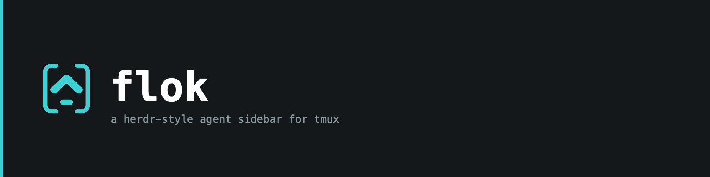
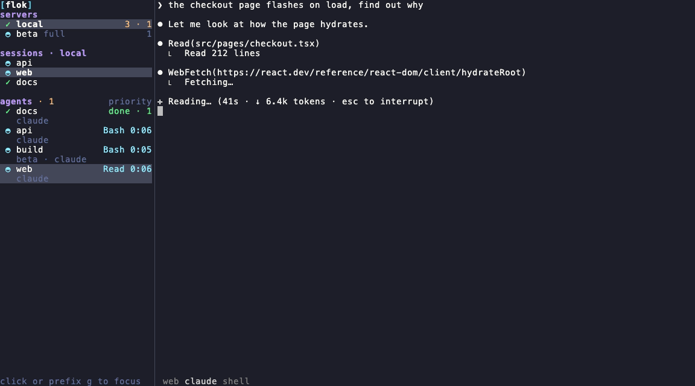
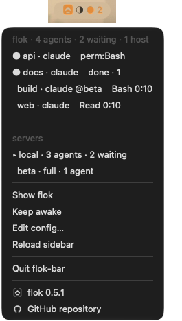

<p align="center"></p>

[](https://github.com/w4jnl/flok/actions/workflows/ci.yml)

See every Claude Code and Copilot CLI session in your tmux, on this machine and on the servers
you ssh into, which one is waiting on you, and jump there. Your tmux servers, configs and plugins
stay untouched.

flok is a narrow sidebar pane next to your normal tmux: the servers when there is more than one,
the sessions, the agents below with their state, a sound when an agent needs you, tmux menus of
all three, and a `prefix ?` popup with your live keybinds. Agents can run wherever the work is:
a host runs the same flok over your ssh config, and its agents, sessions and sounds arrive in the
one sidebar, its tmux a key press away. On macOS a menu bar item shows the same states while the
terminal is behind other windows. The sidebar is modelled on [herdr](https://herdr.dev)'s.

<p align="center"></p>



The macOS menu bar companion, opt-in with `[bar] enabled = true`: the badge counts the agents
waiting on you, the dropdown lists them all with the same state detail as the sidebar (remote
agents tagged `@host`, with a servers block to switch the front once a host is registered), and
a click on a row brings the terminal to the front on that pane. The spinner turns while any
agent works.

<br clear="all">

## Setup

Current version: 0.5.1 · [release notes](CHANGELOG.md). Needs tmux 2.7 or newer (everything
from 3.3) and Claude Code or Copilot CLI; details under [Requirements](#requirements).

1. Install the binary. Homebrew, on macOS or Linux:
   ```sh
   brew install w4jnl/tap/flok
   ```
   Or a prebuilt static binary from the [releases page](https://github.com/w4jnl/flok/releases)
   (Linux and macOS, `amd64` and `arm64`, no Go, no root):
   ```sh
   ver=0.5.1; os=$(uname -s | tr A-Z a-z); arch=$(uname -m | sed 's/x86_64/amd64/; s/aarch64/arm64/')
   curl -fsSLO "https://github.com/w4jnl/flok/releases/download/v$ver/flok_${ver}_${os}_${arch}.tar.gz"
   curl -fsSLO "https://github.com/w4jnl/flok/releases/download/v$ver/sha256sums.txt"
   shasum -a 256 -c --ignore-missing sha256sums.txt
   mkdir -p ~/.local/bin && tar -xzf "flok_${ver}_${os}_${arch}.tar.gz" --strip-components=1 -C ~/.local/bin "flok_${ver}_${os}_${arch}/flok"
   ```
2. Wire it up. This writes a commented `config.toml` with the defaults, installs the Claude Code
   hooks in `~/.claude/settings.json` and writes the Copilot CLI hooks when `~/.copilot` exists:
   ```sh
   flok install
   ```
   Your tmux.conf stays as it is: the sidebar binds flok's keys in your tmux server when it
   starts and removes them when it ends (see [Keys](#keys); `flok install --tmux` prints a
   snippet for those who want them in tmux.conf).
3. Restart the Claude Code and Copilot sessions that are already running. Hooks load at start.
4. Start flok from a plain terminal, not from inside tmux:
   ```sh
   flok up
   ```

`flok doctor` checks every step: tmux version, hooks and the binary they call, sounds,
manifests, the keys flok has in your tmux, the running outer session, every remote host.

### More install options

- From source (Go 1.27): `git clone https://github.com/w4jnl/flok.git && cd flok && make install`
  builds `bin/flok` and copies it to `~/.local/bin`.
- One part at a time: `flok install --claude`, `--copilot` or `--config` do only that step;
  `--tmux` prints the optional tmux.conf snippet, `--tmux-resurrect` the opt-in snippet described
  below.
- Shell completion (commands, flags, pane ids for `explain`, client ttys for `--client`):
  ```sh
  echo 'eval "$(flok completion bash)"' >> ~/.bashrc
  echo 'eval "$(flok completion zsh)"'  >> ~/.zshrc     # after compinit; or: flok completion zsh > ~/.zfunc/_flok
  ```
- From a window manager or a terminal binding: `flok up` exits 0 after a detach or `flok down`,
  so `flok up || tmux attach || tmux new-session` falls back to plain tmux only when flok cannot
  start. `flok up` starts the inner tmux server itself when needed.

### Restore agents with tmux-resurrect

tmux-resurrect restores panes and directories by default, but only restarts programs on its
allowlist. Adding `claude` and `copilot` to that list would restart the CLIs without reliably
selecting the same conversation when several sessions share a directory.

Flok can annotate each tmux-resurrect save with the exact session ID of the conversation in
each pane. Print the opt-in snippet and paste it below the tmux-resurrect/tpm configuration:

```sh
flok install --tmux-resurrect
```

The generated configuration is equivalent to:

```tmux
if-shell -F '#{m:*claude*,#{@resurrect-processes}}' '' "set -ag @resurrect-processes ' claude'"
if-shell -F '#{m:*copilot*,#{@resurrect-processes}}' '' "set -ag @resurrect-processes ' copilot'"
set -g @resurrect-hook-post-save-layout "'/path/to/flok' resurrect save"
```

On every save, `flok resurrect save` rewrites only Claude/Copilot process fields in the new
tmux-resurrect state file:

- Claude Code becomes `claude --resume <exact-session-id>`. The ID comes from Claude Code's own
  registry of running sessions (`claude agents --json`, matched to the pane by tty), which
  describes the live process, and otherwise from the hook record, so a pane whose hooks never
  fired is still saved exactly.
- Copilot CLI becomes `copilot --resume=<exact-session-id>`, from its hook record.
- A recognized agent without a usable session ID is deliberately saved with no process, so its
  restored pane remains a shell instead of opening the wrong conversation. `resurrect.log` in
  the state dir says which panes were skipped and why.

tmux-resurrect still owns pane creation, layout, working-directory restoration and process
launch. This means there is no post-restore race and no dependency on pane IDs being reused.
Conversation history resumes, but a tool that was in flight when tmux died is not rerun. With
tmux-continuum, the restored pane set is as current as its latest save (15 minutes by default).
Trigger a manual tmux-resurrect save after enabling the integration if you want an immediate
baseline.

tmux-resurrect supports one `@resurrect-hook-post-save-layout` command. If that option is already
used, chain both commands in the same shell value rather than replacing the existing hook. Run
`flok doctor` to confirm the hook and process allowlist are visible to the inner tmux server.

If a `~/.tmux.conf` from before tmux 3.1 still sources `~/.config/tmux/tmux.conf`, tmux 3.1+
loads that file twice (it reads both paths itself): every plugin initialises twice and
tmux-continuum starts two restores that type each restored command twice. `flok doctor` warns
about it. Keep the shim for older machines but guard it:

```tmux
# tmux < 3.1 does not read ~/.config/tmux/tmux.conf itself; 3.1+ does, and would load it twice
if-shell 'tmux -V | grep -qE "^tmux (1\.|2\.|3\.0)"' 'source-file ~/.config/tmux/tmux.conf'
```

Restart tmux through `flok up`: it starts the inner server with a throwaway `~flok` session
(a name no saved session can be mistaken for), tmux-continuum restores the saved layout in the
background, the client attaches at once (tmux-resurrect relaunches programs through that
client) and the throwaway session is dropped when the restore is over. Kill both servers (`flok down`, then the inner
`tmux kill-server`) when you want a restore; tmux-continuum skips its automatic restore while
another tmux server, such as flok's outer one, is running.

## Why flok

The problem:

- Several agents run at once, one per tmux session or window, and each shows only its own state.
- There is no glance-level overview. To learn which one finished you cycle through sessions.
- An agent waiting for a permission answer stays unnoticed while you work in another session.
- The work is not all on one machine: a build box, a GPU server, the workstation at the office
  each have their own tmux behind ssh, each in its own terminal window, and the agent that has
  been waiting there for an hour is the one you forgot.

What flok does about it:

- A nested outer tmux server frames your own server with a sidebar. Your server, its config,
  plugins and layouts are never modified; a detach returns you to plain tmux.
- One sidebar for every machine. A host you register runs the same flok over plain ssh (or,
  without flok, is read through its tmux alone): its agents, sessions and sounds arrive here,
  its tmux is attached in a pane next to the sidebar, and one key or click brings a server to the
  front. Agents run where the work is; you watch and answer them from one place.
- Four state sources are merged, with the agents' own hooks as the source of truth: hooks,
  Claude's session registry, pane titles and herdr's screen rules.
- Sounds play only for panes you are not looking at (unless `when_focused`), and are debounced.
- Why not herdr: herdr is its own sidebar application that hosts the terminals; flok wraps the
  tmux you already have. herdr's detection manifests and notification sounds are reused under
  Apache-2.0, see [Credits](#credits-and-license).

## Features

- **Sessions panel**: every tmux session with the git branch of its active pane, the current one
  highlighted, a state dot rolled up from the agents inside it.
- **Agents panel**: every agent pane across all sessions, sorted by attention (blocked, then done,
  then working, then idle), two lines per agent: project and state detail, agent kind and its own
  session title.
- **Live states** from hooks: working with the current tool and elapsed time (`Bash 0:42`),
  blocked (`perm:Bash`, `question`, `elicit`), done with an unread count, idle.
- **Agents across servers**: register the machines you ssh into and their agents join the same
  panels, tagged with their host, attention-sorted together with the local ones. A servers panel
  shows each machine's state and agent count; `Enter`, `prefix F1`…`F9`, `prefix @` or the menu
  bar bring its tmux next to the sidebar, and flok's keys work inside that remote session too.
  A host runs `flok serve` over ssh (hooks and all; `flok host install` puts flok there from
  here), or is read through tmux alone where flok cannot be installed.
- **Sounds** when an agent gets blocked or finishes in a pane you are not looking at; not for
  the pane in front of you unless `[sounds] when_focused = true`; debounced so ten agents
  finishing together beep once.
- **Jump**: click or `Enter` on a row to go to that pane.
- **`prefix o`** goes to the agent that needs you: the newest one waiting for input, else the
  newest one that finished.
- **Menus** over the work pane (tmux 3.0+): `prefix A` the agents, `prefix S` the sessions of the
  server in front, `prefix @` the servers; `1`-`9` picks, each menu links to the other two.
- **Rail** mode at six columns, one keystroke away. The `[flok]` wordmark sits on top of the wide
  sidebar, the mark on the rail.
- **Hide** mode at zero columns, also one keystroke away; the sidebar polls slowly while hidden
  and comes back at its previous width.
- **Keybinds help**: `prefix ?` opens a popup listing all live bindings of your tmux server,
  grouped (flok, prefix, no prefix, copy-mode, plugins), with tmux's own notes as labels and `/`
  to filter.
- **Menu bar companion** (macOS, opt-in): a flok icon in the menu bar that spins while agents
  work, a badge for agents waiting for you, and a dropdown of agents (and of servers, once a
  remote host is registered); a click brings the terminal window to the front and puts you on
  that agent's pane.
- **Keep awake** (macOS, off by default): `flok keep-awake` or the menu bar's "Keep awake" row stops
  the Mac from idle-sleeping and keeps the display on while agents run unattended, until you
  turn it off or flok stops; a ⚡ in the menu bar shows it is on. With
  `[keep_awake] presence = true` Teams, Slack & co. keep showing you as active as well.
- **Zero footprint** on your tmux: no plugin, no pane injected into your windows, no change to
  tmux.conf; the keys flok binds for the session are removed when it ends.
- **tmux-resurrect** (opt-in): saves each Claude Code and Copilot pane with its exact session ID,
  so a restore resumes the same conversations.

## Scope and status

flok is a personal tool. I built it for my own workflow: several Claude Code sessions in
parallel, on the Mac in front of me and on servers over ssh, tmux everywhere, Ghostty on macOS,
herdr's sidebar as the model of what I wanted and nothing beyond it. It is published because there is no reason not to, and because the approach
(a nested outer tmux server, hook-driven agent state) may be useful to others.

What that means in practice:

- Features are the ones I need. Requests that do not fit my workflow will probably be declined,
  politely.
- macOS is the first-class platform; on Linux flok is the terminal sidebar alone (no menu bar
  companion), sounds go through whichever player is installed, and the end-to-end suites run on
  both in CI.
- There is no compatibility promise between versions yet. Read the release notes before
  `brew upgrade`.
- Bug reports with a reproduction are welcome; support is best effort.

flok is at 0.5.1 (2026-09-30). [`CHANGELOG.md`](CHANGELOG.md) lists what changed in every
release, newest first; the same text is on each GitHub release.

## How it works

What the sidebar shows next to your tmux (the servers panel appears once a host is registered;
`beta` here is a machine reached over ssh, its agent `build` listed with the local ones):

```
┌──────────────────────────┬────────────────────────────────────────┐
│ servers                  │                                        │
│  ◑ local            3 · 1│   the work pane: your tmux server, or  │
│  ○ beta full           1 │   a host's over ssh, both untouched    │
│                          │   (sessions, windows, plugins, keys)   │
│ sessions · local         │                                        │
│  ◑ Claude          main  │                                        │
│  ○ Hugo            main  │                                        │
│  ● flok            main  │                                        │
│                          │                                        │
│ agents · 1     priority  │                                        │
│  ● flok        perm:Bash │                                        │
│    claude · feasibility  │                                        │
│  ◑ trading-jou… Bash 0:42│                                        │
│    claude · add-settle…  │                                        │
│  ◑ build        Bash 0:08│                                        │
│    beta · claude         │                                        │
│  ○ mwrelay               │                                        │
│    claude · store-forwa… │                                        │
│ j/k ⏎ ⇥ 1-9      ? help  │                                        │
└──────────────────────────┴────────────────────────────────────────┘
```

### Two tmux servers

```
Ghostty (or any terminal)
└── outer tmux server   socket "flok" · prefix None · status off · mouse on
    └── session "flok"
        ├── window 0
        │   ├── left pane   flok sidebar            (Bubble Tea program)
        │   └── right pane  tmux attach ───────────► inner tmux server   (your normal server)
        │                                            ├── session Claude   ├─ window 1 ─ pane: claude
        │                                            ├── session Hugo     │            ─ pane: zsh
        │                                            └── session ...      └─ ...
        └── window flok-host-beta   (one parked window per registered host)
            └── pane  ssh -t beta tmux attach ────► beta's tmux server; swapped in next to the
                                                     sidebar when beta comes to the front
```

`flok up` starts the outer server from a generated config and attaches your terminal to it. The
outer server has no prefix key and no status bar, so every keystroke and mouse event reaches the
inner tmux exactly as before; it merely frames your session with a sidebar. A remote host gets
the same treatment: its `ssh -t … tmux attach` lives in a parked window of the outer, and
bringing the host to the front is one `swap-pane`, so your keys reach that tmux just as directly. The right pane runs an
attach loop: a killed session re-attaches elsewhere, a deliberate detach (`prefix d`) tears the
outer down and returns you to the shell.

The sidebar never modifies the inner server. It reads it (`list-sessions`, `list-panes`,
`list-clients`, `capture-pane`, `list-keys`) and drives your client with `switch-client`,
`select-window` and `select-pane`. The `prefix` bindings it adds for the session (or the
optional tmux.conf snippet) are plain `run-shell` calls to `flok jump|next|toggle|hide|focus|
menu …|host …`; the help is `flok keys --open`, a popup on tmux 3.2+.

### Where agent state comes from

```
 Claude Code / Copilot CLI ──hooks──► flok hook ──► ~/.local/state/flok/agents/<pane>.json
                                                  (per-pane record, flock + atomic write, plays the sound)
                                                              │ fsnotify
 tmux snapshot (1 s) ──────────────────────────────────────┐  │
 claude agents --json (10 s, pid → tty → pane) ────────────┤  ▼
 capture-pane + title + OSC 9;4 progress (2 s, rule engine)┴► merge.Build ──► sidebar view
                                                               │
                                                               └─ seen marks (done → idle once you look)
```

Four sources feed the merge, most authoritative first:

| source | what it gives | when it is used |
|---|---|---|
| **Hooks** (`flok hook claude`, `flok hook copilot`) | exact transitions: prompt submitted, tool start/end with the tool name, permission request, question, stop, session end | always, for agents started after `flok install` |
| **Claude's registry** (`claude agents --json`) | busy / idle per running session, matched to a pane through the process tty | the label, and clearing a turn that ended without a Stop hook (Esc, usage limit, error): two idle samples, or the screen rules showing a bare prompt box three times, whichever comes first |
| **Pane title** | Claude Code writes `✳ <name>` and a spinner glyph | the agent's own session name; a spinner counts as working. An idle glyph is *not* evidence: inside tmux Claude keeps `✳` while busy |
| **Screen rules** | herdr's detection manifests (TOML, Apache-2.0) evaluated over the visible pane text, the title and tmux's OSC 9;4 progress state | agents without hooks, and hook-driven agents while working or blocked, to notice a prompt dismissed with Esc |

A host in full mode runs this same pipeline on its side (`flok serve`, started over ssh) and
streams the merged result; the local sidebar federates every host's view with its own, so a
remote agent is sorted, coloured and sounded exactly like a local one, with the host's name on
its row. A plain-mode host is read through its tmux from here: titles and screen rules only.

The hook record is the source of truth for hook-driven agents. The other sources only refine it
in two narrow cases: two consecutive registry samples saying idle (or, without a registry, the
idle prompt box visible for three polls, six while Claude's registry still reports it busy) end a *working* state that no hook closed; the idle
prompt box visible for two polls clears a *blocked* state whose dialog is gone. A `~` before an
agent's name means no hook data has arrived for that pane (restart the agent after `flok install`).

### States

| state | glyph | colour | entered by | left by |
|---|---|---|---|---|
| working | `◐◓◑◒` | cyan | prompt submitted, tool start/end; a Stop while background subagents or shells are in flight keeps it working ("2 agents") | stop with nothing in flight, block, interrupted turn |
| blocked | `●` | orange | permission request, `AskUserQuestion`, elicitation dialog, a visible prompt the hooks missed | tool end, next prompt, stop, dialog gone |
| done | `●` | green | stop while the pane is not the one you look at | looking at it (or jumping there) |
| idle | `○` | grey | session start, stop while you watch, done once seen | prompt |
| unknown | `◌` | grey | agent present, no signal yet | any signal |

A *done* agent keeps an unread counter (`done · 2` = one block plus one completion you did not
see). Looking at the pane, `Enter`, a click or `prefix o` marks it seen. Sounds: blocked and done
play their own sound, error a third; nothing plays for the pane that is currently in front of
you (set `[sounds] when_focused = true` to hear it there too), and repeats within 750 ms are
dropped.

### The menu bar companion (macOS)

```
sidebar ──publishes──► ~/.local/state/flok/snapshot.json ──fsnotify──► flok-bar   [ ⩓ ◑ ● 2 ]
                                                                            │ click on an agent row
                                                                            ▼
                                                                   flok goto <pane-id>
                                                       (switch the inner client, mark seen,
                                                        focus the terminal window)
```

`flok-bar` is a second binary, the only one that needs cgo (`fyne.io/systray`), built on macOS
only. It never talks to tmux itself: the sidebar publishes its merged view as a JSON snapshot
(rewritten on change and every 5 s as a heartbeat), the bar renders it and forwards clicks to
`flok goto`. The title text is `○` when everything is idle, an animated `◐◓◑◒` while an agent
works, and `● N` when N agents are waiting for you (the icon gains a dot as well); `⚡` follows
the glyph while keep-awake is on (`◑ ⚡ ● 2`). The dropdown
lists agents in the sidebar's order with the same state detail, remote ones tagged `@host`, and
once a host is registered a `servers` block: local first, then every host with its mode, agent
count or connection state, the front one marked; a click brings that server's work pane to the
front (`flok host front <name> --focus`). With `[bar] enabled = true`,
`flok up` starts the bar (single instance) and `flok down` or a detach ends it; the bar also quits
by itself 30 s after flok disappears.

Click-to-return uses AeroSpace when it is installed (`aerospace focus --window-id` on the window
titled `TMUX…`, which also switches workspace) and AppleScript otherwise: it activates the terminal
app that ran `flok up` (recorded from `TERM_PROGRAM`: Ghostty, iTerm2, Terminal, WezTerm, kitty) and,
best effort, raises the `TMUX…` window. Raising a specific window goes through System Events and
needs Accessibility permission for `osascript`; without it the app comes to the front with its
last-used window, which is usually the right one anyway.

### Keep awake (macOS)

```
flok keep-awake / "Keep awake" ──writes──► ~/.local/state/flok/keep-awake (0|1)
                                                 │ fsnotify
                                                 ▼
                  sidebar: IOPMAssertionCreateWithName  ──► snapshot.json "keep_awake" ──► ⚡, ✓ row
```

`flok keep-awake` does what `caffeinate -d -i` does, without running another program: the sidebar
takes the two IOKit power assertions itself, `PreventUserIdleDisplaySleep` (the display stays on,
so neither the screen saver nor the idle lock kicks in) and `PreventUserIdleSystemSleep`. They
are called through [purego](https://github.com/ebitengine/purego), so the flok binary stays
cgo-free. Because the sidebar holds them, they cannot outlive the session: macOS drops them the
moment the sidebar exits, including a crash or a killed tmux server, and `flok down` or the
end of the session turns keep-awake off; the next `flok up` starts with it off. `flok reload`
keeps it (the new sidebar takes the assertions again).

`flok keep-awake` with no argument toggles; `on`, `off` and `status` do what they say, and
`--notify` puts the result on tmux's status line instead of printing it, which is what the
snippet's `prefix u` binding uses. It waits
until the sidebar confirms the change and prints the result. While it is on, `flok status`
adds a `keep-awake: on` line (`"KeepAwake": true` in `--json`), `flok doctor` reports it, and
`pmset -g assertions` lists both assertions for the sidebar's pid under the name
`flok keep-awake`. It needs flok to be running and is macOS only; on Linux the command says so.
Closing the lid of a MacBook on battery still puts it to sleep; no user-space program can
prevent that.

**Staying active in Teams, Slack & co.** The power assertions keep the Mac and its display
awake, but apps that show your presence watch the time since your last key press or mouse
move, so Teams still turns you Away after five minutes. With `[keep_awake] presence = true`
the sidebar also resets that clock while keep-awake is on: after 60 s without input it posts
an empty modifier-key event (a "flags changed" event that carries the modifiers already held,
so no app sees a key press and the cursor does not move; checked every 30 s). It skips the
nudge while the display sleeps, so a display you put to sleep yourself stays asleep. macOS
only accepts synthetic input from apps with Accessibility permission: grant it to the terminal
app you run `flok up` in (System Settings › Privacy & Security › Accessibility). `flok doctor`
says whether that is in place; `flok keep-awake status`, `flok status` (`"KeepAwakePresence"`
in `--json`) and the menu bar tooltip report the presence as active, or blocked when macOS
drops the events. The key is read when the sidebar starts; `flok reload` applies a change.

### Remote hosts

Agents do not have to run where you sit. One flok shows and drives tmux servers on other
machines, over plain `ssh` with your `~/.ssh/config` (aliases, jump hosts, keys or an agent;
flok never answers a password prompt), and treats them like the local one: same panels, same
keys, same sounds, one work pane that shows whichever server is in front:

```sh
flok host add beta jaro@beta              # full: flok on the host streams its agents
flok host add gpu-1 --mode plain          # plain: tmux only, titles and screen rules
flok host install beta                    # no flok there yet? put this one there over ssh
flok host status                          # connect to each once and report
flok doctor                               # probes every host: tmux, flok, hooks, terminfo
```

A host with tmux but without flok reads `no flok`; `flok host install <name>` (or `I` on its row
in the servers panel, which shows the progress in a popup, or `flok host add … --install`) puts
flok there from your machine, over the same ssh, into `~/.local/bin/flok` on the host, which
flok already looks at, so nothing on the host needs configuring and no root is involved. A
host with your OS and CPU gets this very binary (it works offline and carries dev builds);
another gets the release tarball from GitHub, checked against its `sha256sums.txt`
(`--version` picks one; a local build that is no release takes the latest release). The new
flok must answer `flok version` on the host before it replaces an old one, so a build that
cannot run there changes nothing. `--from <file>` pushes a binary you built yourself.
`--hooks` also runs `flok install --claude` / `--copilot` there for the agent folders it finds
(`~/.claude`, `~/.copilot`). The same command upgrades an old flok; the sidebar reconnects by
itself. A Homebrew flok on the host is shadowed afterwards (`flok host set <name> --flok ""`
returns to it).

The first argument of `flok host add` is flok's **name** for the host, the second the ssh
**target**, passed to `ssh` exactly as typed. With the target alone the name is taken from it:
an ssh alias as it is spelled (`flok host add dockerAMS` names it `dockerAMS`), the first label of
a DNS name (`jaro@beta.example.org` → `beta`), an IPv4 address with dashes. Names are letters,
digits, `_` and `-` (at most 32); they keep their case but match in any case, so `flok host
connect dockerams` finds `dockerAMS`, and two names that differ only in case cannot both exist.

Hosts live in `hosts.json` in the state dir, not in `config.toml`: `flok host add|set|remove|
connect|disconnect` (or `c` on a row of the servers panel) changes the set while flok runs, and
`flok up` reconnects the enabled ones. `[hosts]` in `config.toml` holds the ssh defaults.

In **full** mode the local flok runs `flok serve --stdio` on the host: the same hooks, Claude
registry and screen rules the sidebar would use there, merged on the host and streamed back as
JSON lines over the ssh session. The sounds play here; the host's own hooks stay silent while it
is served (a `served` record in its state dir says so). In **plain** mode the local flok drives the
host's tmux over ssh itself: titles and screen rules, no hook states, slower polls; for hosts
where flok cannot be installed.

The sidebar grows a **servers** panel above the sessions: local first, then the hosts in the
order they were added, each with its mode (`full` or `plain`) after the name, its rollup glyph
and agent count (an orange `· 2` for agents waiting there), or its connection state (`connecting`, `retry in 8s`, `needs auth`, `no flok`,
`busy`, `incompatible`, `off`). `Enter` on a host brings its work pane next to the sidebar; the
sessions panel then shows that host's sessions (`sessions · beta`). The agents panel shows every
host, attention-sorted, remote rows tagged with their host (`beta · claude · fix login`).

```
local machine                                              host "beta" (mode full)
outer tmux -L flok                                         ┌───────────────────────────┐
 window 0        [ sidebar | work pane of the front host ] │ tmux server (yours)       │
 flok-host-beta  [ ssh -t beta tmux attach ]  ◄── swap ──► │  ▲ attached from the pane │
 flok-host-gpu-1 [ ssh -t gpu-1 tmux attach ]              │ flok serve --stdio ◄ hooks│
 sidebar ─ remote.Manager ── ssh -T beta flok serve ──────►│  agents, sessions, focus  │
           merge.Federate ◄── snap / event ── goto / seen ►└───────────────────────────┘
```

Every enabled host keeps a persistent `ssh -t … tmux attach` pane parked in a hidden window of
the outer server, so switching hosts is one `swap-pane`: instant, no reconnect, `flok hide`
keeps working. A host with tmux installed but not running gets a server from that pane (`tmux
new-session -s main`, the name from `[hosts] session` or the host's `--session`), so a fresh box
needs nothing but tmux. The parked pane re-attaches by itself when you detach inside the remote
tmux, and shows one status line and a countdown while the host is unreachable. The data channel
reconnects with a backoff of 1, 2, 4 … 30 s; `needs auth`, `host key`, `no flok` and
`incompatible` are retried once a minute with the fix spelled out, `busy` (another flok already
serves that host) every 10 s. A laptop going to sleep ends the dead ssh within about 45 s; the
host's `flok serve` exits on the closed pipe and its hooks play there again.

Navigation crosses hosts: `prefix o` goes to the agent needing you on any host, `1`-`9`, a
click and the menu bar reach any row, `flok goto beta:%12` scripts it; `prefix a` walks the
agents of the host in front, so a step never swaps the work pane. `flok host front beta` (or
`local`) switches hosts from a key binding, `flok host next|prev|last` rotates, `flok menu
servers` (`prefix @`; `flok menu agents` and `flok menu sessions` are its siblings on `prefix A`
and `prefix S`, each menu linking to the other two) shows a tmux menu of them, the menu bar's
servers block does the same with a click, and the same keys work with a remote server in front.
Every switch
flashes `flok: now on <server>` on the status line of the server that came to the front, the
one the work pane shows.

flok's keys work inside a remote session too, without touching the host's tmux config: while a
host is connected, flok binds `prefix b B g o a u`, the menus `A S @` and the server keys
`N P O F1`…`F9` in that tmux server (`bind-key` lives in the running server, not in a file) and
puts the host's own bindings of those keys back when it disconnects. What a key had before is noted in that server too (`@flok-orig-<key>` user
options), so a session that ends abruptly loses nothing: the next one restores from the note.
A connected host also takes your local prefix: its own moves to `prefix2`, so both `C-a b` and
its native chord work there, and `<prefix> <prefix>` still sends the key through; everything
goes back on disconnect (`[hosts] prefix = false` leaves hosts' prefixes alone). A host whose
flok predates the key relay is called out by `flok doctor`, `flok host status`, the host info
screen (`i` in the servers panel) and the sidebar footer instead of failing silently.
On a full-mode host the binding runs `flok relay <cmd>` and `flok serve` forwards it
at once; on a plain host it sets a tmux user option that the next poll picks up (within a
second). Either way the local sidebar runs the same `flok toggle|hide|focus|jump|next|menu …|
host …|keep-awake` the local binding would. `[hosts] keys = false` turns it off. `prefix ?`
stays the remote tmux's own list-keys.

Security: ssh only, no listening sockets, no daemons. The local side execs the ssh argv (never a
shell) with `BatchMode=yes`, its own ControlMaster socket under `~/.local/state/flok/ssh`
(0700) and no agent forwarding unless `[hosts] ssh_options` adds it; the remote commands are
fixed strings built from validated fields. Host keys are accepted by you, once, with a plain
`ssh <target>`. `flok serve` reads only its own state dir and drives only its own tmux server.
tmux-resurrect stays per host; "restoring" the local side is reconnecting at `flok up`.

### The help popup

`prefix ?` runs `flok keys` in a tmux popup. It reads `list-keys` for the prefix, root and
copy-mode tables of the inner server, keeps tmux's own notes as labels for stock bindings,
translates common commands for the rest (`select-pane -L` becomes "pane left"), groups plugin
bindings by the plugin directory in their `run-shell` path, and hides mouse bindings unless asked.
Nothing is hand-maintained: what the popup shows is what your server has bound right now.

## Requirements

- tmux 2.7 or newer, macOS or Linux. Everything works from 3.3; older servers lose a little
  (see the table below). `flok doctor` prints the version it found and what that version lacks.
- Claude Code and/or GitHub Copilot CLI for hook-driven state. Other agents get title and
  screen-rule detection only (manifests exist for Codex, Gemini and OpenCode).
- A sound player for the notification sounds: `afplay` on macOS; on Linux the first of `mpv`,
  `ffplay`, `pw-play`, `paplay`, `play` (sox) found on PATH, or any command via `[sounds] command`.
  Without one flok rings the terminal bell instead (`[sounds] bell = "auto"`), which reaches
  your local terminal even when the agents run on a remote host over ssh.
- Go 1.27 only if you build from source.

### tmux versions

| tmux | shipped by | what flok does there |
|---|---|---|
| 3.3 and newer | RHEL 10 (3.3a), Debian/Ubuntu (3.4+), Homebrew (3.7) | everything |
| 3.2a | RHEL 9 | full sidebar; the keybinds popup has no border or title; no `allow-passthrough` for the inner server's apps; terminal focus is not tracked (done/idle assumes the terminal is focused) |
| 2.7 | RHEL 8 | degraded: keybinds help opens in a new window instead of a popup, no extended keys (shift+enter-style bindings inside agents) through the outer server, a crashed sidebar's pane closes instead of staying respawnable |

Below 2.7 `flok up` refuses to start. The gates live in `internal/tmux/version.go`; CI runs the
end-to-end suites on macOS (3.7), Ubuntu (3.4), Rocky 9 (3.2a) and Rocky 8 (2.7).

## Keys

In tmux (your prefix):

| key | action |
|---|---|
| `prefix b` | toggle the sidebar between full width and the rail |
| `prefix B` | hide / show the sidebar (zooms the work pane) |
| `prefix g` | move the keyboard into the sidebar, or back to the work pane |
| `prefix o` | jump to the newest agent needing input, else the newest finished one |
| `prefix a` | next agent pane, in sidebar order |
| `prefix A` | a tmux menu of the agents over the work pane: `1`-`9` open one, remote ones tagged `@host` (tmux 3.0+) |
| `prefix S` | the same for the sessions of the server in front, the current one marked |
| `prefix @` | the same for the servers (as in `@beta`): local and the hosts with their state |
| `prefix u` | keep the Mac awake, display on, while flok runs; toggles, the state shows on the status line (macOS) |
| `prefix ?` | keybinds help popup (`?` inside the sidebar opens the same) |
| `prefix N` / `prefix P` | next / previous server to the front (local, then the hosts in order, wrapping) |
| `prefix O` | the previous server again (back and forth) |
| `prefix F1` … `F9` | server N to the front: F1 is local, F2 the first host |

The sidebar binds them in your tmux server when it starts and removes them when it ends
(`flok down`, a detach, a crash of the outer): nothing in tmux.conf. `[keys] bind` says how far
it goes: `missing` (the default) binds only the keys nothing else uses, so tmux's own `prefix o`
(next pane) and `prefix ?` (list-keys) keep working and flok's jump and help are reached from the
sidebar instead; `all` takes those over for the session too and puts them back at the end; `off`
binds nothing. If you would rather have the bindings in your config, `flok install --tmux` prints
the same keys as a snippet (paste it below the tpm `run` line, where plugins cannot overwrite
it); the sidebar then leaves them alone. A key still running an older snippet's flok command
(`prefix A` was "previous agent", `prefix S` the servers menu) is brought up to date for the
session, the footer says so, and the current snippet replaces the old one. `flok doctor` lists
which keys flok has, which are unbound, which tmux or you bound to something else and which an
older snippet still holds.

Menu bar (when enabled): click an agent row to return to it (remote agents read `project ·
claude @beta`; under them a `servers` block lists local and every host, the front one marked, and a
click brings that server's pane to the front), "Show
flok" to bring the terminal window to the front, "Keep awake" to toggle it (checked while it is on), "Edit config…" to
open `config.toml` (in a new tmux window with `[bar] editor`
set, else with the default app), "Reload sidebar" to apply it, "Quit flok-bar" to remove the item
(flok keeps running). The version row at the bottom opens the release notes (`CHANGELOG.md`,
all releases newest first) and "GitHub repository" the source.

Inside the sidebar (`prefix g`, a click, or `flok focus`):

| key | action |
|---|---|
| `j` `k` / arrows / wheel | move the cursor |
| `Tab` / `Shift-Tab` | cycle the panels: servers (with remote hosts), sessions, agents |
| `Space` | servers panel: bring the host's work pane to the front, keyboard stays in the sidebar |
| `c` / `d` | servers panel: connect / disconnect the host (persisted: `off` until `c`) |
| `r` | servers panel: reconnect the host now (elsewhere: refresh) |
| `m` | servers panel: flip the host's mode, full ↔ plain |
| `x` | servers panel: remove the host (asks `y/n` in the footer) |
| `i` | servers panel: host details (target, mode, state and hint, flok and tmux versions, agents) |
| `Enter` | open the selected row and hand the keyboard to the work pane (a servers row brings that host's work pane to the front) |
| `1`-`9` | open agent N; `!` `@` `#` … open session N |
| `g` / `G` | first / last row |
| `n` | name the agent row under the cursor (Enter saves; an empty name restores the directory name) |
| `?` | keybinds help |
| `Esc` / `q` | keyboard back to the work pane |

An agent row is named after the directory its session started in (a `cd` Claude keeps between
Bash calls does not rename it); `n` gives it a name of your own, which sticks to that pane across
the agent's sessions (`names.json` in the state dir). A click opens the row but keeps the keyboard in the sidebar. The footer says where the keyboard
is; in rail mode the `›` cursor is pink while the sidebar has it. Any `prefix <key>` chord typed
while the sidebar has focus is replayed into the work pane, so all your bindings keep working;
only `prefix b` keeps the cursor in the sidebar so you can collapse it and continue.

## Commands

```
flok up [--detach]          start or re-attach the outer session (your server keeps running)
flok down                   stop the outer session
flok keep-awake [on|off|toggle|status] [--notify]   keep the Mac awake, display on, while flok runs (macOS)
flok status [--json]        one-shot dump of sessions and agents
flok jump | next | prev     navigation, used by the bindings           [--client <tty>]
flok menu agents|sessions|servers   a tmux menu over the work pane (prefix A / S / @), 1-9 picks
flok toggle | hide | focus  sidebar layout and keyboard focus
flok goto [pane] [--no-focus]   switch to an agent pane (%12 here, beta:%12 on a host) and bring the
                            terminal window to the front
flok edit-config [--no-focus]      open config.toml (new tmux window with [bar] editor, else default app)
flok reload                 restart the sidebar pane after editing config.toml
flok keys [--print [--filter q]]   keybinds help; --print dumps it as text
flok explain [pane ...]     which screen-detection rules match agent panes
flok install [--config] [--claude] [--copilot]   config.toml and the hooks; [--tmux] prints the optional snippet
flok doctor                 checks tmux, hooks, sounds, the outer session and every remote host
flok completion bash|zsh
flok host add [<name>] <user@host|ssh alias> [--mode full|plain] [--socket name] [--session name]
              [--flok /path/to/flok] [--term name] [--disabled] [--install [--hooks]]   register a remote host
flok host install <name> [--from file] [--version v] [--hooks] [--open] [--wait]   put or upgrade flok on the host from here
flok host reconnect <name>        the running sidebar redials the host now
flok host set <name> [--mode full|plain] [--target t] [--socket s] [--session s] [--flok p] [--term t]
flok host remove | connect | disconnect <name>
flok host list [--json|--names]  |  flok host status [--json]  |  flok host front <name>|local|<N> [--focus]
flok host next | prev | last | menu     rotate the server in front, or pick one from a tmux menu
flok serve --stdio | --hello      run headless on this host for a flok elsewhere (started over ssh by it)
```

## Configuration

`~/.config/flok/config.toml`; every key is optional, defaults shown. `flok install` writes this file
with everything commented out if it does not exist; `flok reload` applies edits.

```toml
[inner]
socket = "default"          # your tmux server (-L name)
session = ""                # attach a specific session; empty = most recent
reattach_on_detach = false  # false: `prefix d` closes the flok window like a normal detach;
                            # true: it re-attaches at once. A killed session always re-attaches elsewhere.

[outer]
socket = "flok"
session = "flok"
extra_conf = "~/.config/flok/outer.extra.conf"   # sourced by the generated outer config

[sidebar]
width = 28                  # pinned: window resizes never scale the sidebar
rail_width = 6              # rail rows: sessions as ①②…, then "<n> <status>" per agent
rail_threshold = 12         # narrower than this renders the rail
sessions_max_ratio = 0.4    # at most this share of the height for the sessions list
session_order = "index"     # same order as tmux's chooser (prefix s): index | name | activity
agent_rows = 2              # 2: project + "kind · title" line per agent; 1: single line
show_branch = true
brand = true                # [flok] wordmark on top (the mark on the rail)
branch_source = "active_pane"   # or "session_path"
poll_ms = 1000
idle_poll_ms = 3000         # while the sidebar is hidden (prefix B); the spinner pauses too
spinner_ms = 250            # working-spinner frame interval in the sidebar
fps = 15                    # renderer frame-rate cap; 60 (Bubble Tea default) wakes up needlessly often
registry_poll_ms = 10000    # `claude agents --json` costs ~0.2 s CPU: polled at this rate only while a
                            # Claude turn/prompt is open or a pane lacks hooks, otherwise once a minute
screen_poll_ms = 2000
capture_lines = 0           # extra scrollback lines for screen rules (0 = visible screen only)

[agents]
enabled = ["claude", "copilot"]
manifest_dir = "~/.config/flok/agents"   # per-agent TOML overrides of the bundled manifests
use_herdr_cache = false     # also read herdr's own manifest cache when herdr is installed
screen_rules = "auto"       # auto | always | never

[keys]
bind = "missing"            # at start, bind flok's keys in your tmux for the session: missing = only
                            # keys nothing else uses | all = override tmux's own o and ? too | off
show_mouse = false
tables = ["prefix", "root", "copy-mode-vi"]
[keys.labels]               # command prefix -> label overrides for the help popup
# "select-pane -L" = "west"

[sounds]
enabled = true
player = "hook"             # hook | sidebar | none (who plays: the hook process or the sidebar)
command = ""                # "" = first on PATH of afplay, mpv, ffplay, pw-play, paplay, play;
                            # or your own, e.g. "paplay --volume=40000 {file}" ({file}, {volume} expand)
bell = "auto"               # auto: ring the terminal bell instead when no player exists (headless or
                            # ssh hosts; the bell reaches your local terminal); always: bell and sound; never
volume = 0.6
min_interval_ms = 750
when_focused = false        # true: also for the agent pane you are looking at (done, badge and sound
                            # as if you were elsewhere); default: a watched pane ends idle, silently
done = ""                   # empty = bundled done.wav; or e.g. "/System/Library/Sounds/Glass.aiff"
blocked = ""                # empty = bundled request.wav (also used for error)
error = ""

[bar]                       # macOS menu bar companion, started by `flok up` (ignored on Linux)
enabled = false
animate = true              # spin ◐◓◑◒ in the menu bar while an agent works
animate_ms = 0              # frame interval; 0 = the sidebar's spinner_ms (250, 4 fps); every frame
                            # redraws the status item, 500 halves that CPU
color = true                # icon teal while an agent works, icon and badge orange while one waits on
                            # you; the spinner stays in the menu bar colour (state palette; no extra CPU)
icon_size = 18              # icon height in points (16 is the usual size)
blink = true                # while an agent waits on you the icon blinks (outline/solid, ~1.15 s) until
                            # the terminal window is focused
badge = true                # "● N" for agents waiting for you (icon gains a dot too)
focus = "auto"              # click-to-return: auto | aerospace | applescript | none | "shell command"
app = ""                    # terminal to focus; empty = the one `flok up` ran in (TERM_PROGRAM)
max_rows = 16
editor = ""                 # "Edit config…" in the bar: "nvim" opens it in a new tmux window; "" = `open`

[keep_awake]                # macOS: `flok keep-awake` / the menu bar's "Keep awake" row
presence = false            # true: while keep-awake is on, also keep you "active" in Teams, Slack and
                            # other apps that watch input idle time (an empty modifier-key event after
                            # 60 s without input; needs Accessibility for your terminal app)

[hosts]                     # remote tmux servers shown next to the local one; the list itself is
                            # dynamic: flok host add [<name>] <user@host> (flok host --help)
ssh = "ssh"                 # ssh binary; aliases, jump hosts and keys come from ~/.ssh/config
ssh_options = []            # extra ssh arguments, e.g. ["-o", "IdentitiesOnly=yes"]; yours come first
connect_timeout_s = 10
backoff_max_s = 30          # reconnect backoff 1, 2, 4 … up to this many seconds
multiplex = true            # one ControlMaster connection per host, shared by the data channel,
                            # tmux calls and the work pane (sockets under the state dir)
session = "main"            # a host whose tmux is not running gets this session from its work pane
keys = true                 # bind flok's keys (prefix b B g o a u, the menus A S @, N P O F1…F9) in a
                            # host's tmux while connected
remote_path = "/opt/homebrew/bin:/usr/local/bin:$HOME/.local/bin:/opt/local/bin"
                            # appended to PATH for every command flok runs on a host: a non-interactive
                            # ssh shell sees only the system PATH (Homebrew's tmux would be invisible)
serve_command = "flok serve --stdio"   # what mode full runs on the host; flok host add --flok <path>
                            # names the binary per host when it is not on the non-interactive PATH

[theme]                     # Dracula by default; state tokens may name a colour or a hex value
mode = "auto"               # auto: follow the terminal's background, asked at `flok up` | dark | light
working = "cyan"
blocked = "orange"
done = "green"
idle = "comment"
brand = "#3FD0D4"           # wordmark / rail mark accent

[theme.light]               # palette for light terminals (Dracula's Alucard); same keys as [theme]
brand = "#12999D"
```

## Files

| path | content |
|---|---|
| `~/.config/flok/config.toml` | configuration |
| `~/.config/flok/agents/*.toml` | your overrides of the detection manifests |
| `~/.local/state/flok/agents/` | one JSON record per agent pane, written by the hook |
| `~/.local/state/flok/seen/` | when you last looked at each agent pane |
| `~/.local/state/flok/names.json` | row names chosen with `n`, by pane (`%12`, `beta:%12`) |
| `~/.local/state/flok/events.log` | every hook event with the resulting state (JSON lines) |
| `~/.local/state/flok/runtime.json` | the running outer session: panes, sockets, client tty, terminal app |
| `~/.local/state/flok/snapshot.json` | the sidebar's merged view, read by flok-bar |
| `~/.local/state/flok/flok-bar.pid` | the menu bar process started by `flok up` |
| `~/.local/state/flok/keep-awake` | `1` while `flok keep-awake` asks the sidebar to keep the Mac awake |
| `~/.local/state/flok/keys.json` | the keys the sidebar bound in your tmux for this session, and what `all` replaced |
| `~/.local/state/flok/outer.conf` | the generated outer tmux config |
| `~/.local/state/flok/hosts.json` | the remote hosts (`flok host …`), with `enabled`, a probed `flok` path and `last_connected` |
| `~/.local/state/flok/hosts/<name>/` | a plain-mode host's local store (records, seen marks) |
| `~/.local/state/flok/ssh/` | flok's ssh control sockets (0700) |
| `~/.local/state/flok/requests/` | one-shot commands for the running sidebar (`flok goto beta:%12`, `flok host front`) |
| `~/.local/state/flok/serve.lock`, `served` | on a served host: the lock `flok serve` holds and who holds it |
| `~/.claude/settings.json` | the hook entries `flok install --claude` adds (a backup is written) |
| `~/.copilot/hooks/flok.json` | the Copilot CLI hook file |

`FLOK_CONFIG` and `FLOK_STATE` override the two locations.

## Troubleshooting

- `flok doctor` first. It reports the binary path the hooks use, missing hooks, which keys flok
  has in your tmux, the manifests and whether the outer is running.
- The footer says `older tmux snippet: A → prev`: your tmux.conf still carries a flok snippet from
  before the menus. Replace it with the one `flok install --tmux` prints, or drop it and let the
  sidebar bind the keys itself.
- `flok status` shows what the sidebar sees, with the source of each state (`hook`, `registry`,
  `title`, `screen`). `flok explain <pane>` lists the screen rules matching a pane.
- `tail -f ~/.local/state/flok/events.log` while an agent works shows the hook events arriving.
  No events for a pane usually means the agent was started before `flok install`; restart it.
- `FLOK_DEBUG=1 flok up` logs every key the sidebar receives to `sidebar.log` in the state dir.
- If you moved the binary (for example from `make install` to Homebrew), run `flok install` again;
  it rewrites the hook commands to the new absolute path.
- A host reads `needs auth` or `host key`: run `ssh <target>` once by hand (flok uses
  `BatchMode=yes`, so it never types a password or accepts a key); `no flok`: the host has no
  flok on its non-interactive PATH: `flok host install <name>` (or `I` on its row) puts this one
  there, or register an existing one with `--flok /path/to/flok`, or use `--mode plain`;
  `old flok`: the flok there predates `serve` (the row names its version), `flok host install
  <name>` upgrades it; `no
  server`: tmux is there but not running for the user and socket you registered (the footer
  shows the socket path); the work pane starts one as soon as the host is connected in the
  sidebar (`[hosts] session`), so this only lingers when the sessions live under another user
  or socket, then `flok host set <name> --target user@host` or `--socket`; "no tmux
  on the host's PATH": tmux lives somewhere the non-interactive shell does not look, add that
  directory to `[hosts] remote_path` (Homebrew, /usr/local and ~/.local/bin are there by default);
  `incompatible`: the two floks speak different protocols, `flok host install <name>` puts this
  one's version there; `busy`: another flok
  (or a `flok host status` still running) serves that host. `flok doctor` runs the same probe on
  every host and says which of tmux, flok, the hooks or the terminfo entry is missing there.
- Agents on a full-mode host show only title and screen states: `flok install --claude` was not
  run on that host (`flok doctor` reports it). Sounds for remote agents play on the local side;
  `FLOK_DEBUG=1` writes the connection log to `remote.log` in the state dir.

## Development

```sh
make build             # bin/flok with the version stamped from git describe
make test              # unit tests
make e2e               # headless end-to-end suites on isolated tmux servers, m1..m10, in order
scripts/e2e/m4.sh      # one suite (make e2e SUITES="m4 m7" for a few)
make icons             # regenerate the menu bar template icons (assets/icons/gen)
scripts/spike/m0-outer.sh check   # nested-outer passthrough checks
scripts/spike/m0-outer.sh up      # interactive checklist against your real server
```

The end-to-end suites start their own tmux servers (`e2e-inner`, `e2e-outer`) with a private
state and config directory, run a fake agent binary named `claude` that paints scripted screens,
replay hook payloads against it, and assert on `capture-pane` output of the sidebar. Your real
tmux server is never touched. `scripts/e2e/run-all.sh` runs them in order, every one even after
a failure, each under a watchdog (`E2E_SUITE_TIMEOUT`, 300 s), and ends with a table; a suite
that died prints `ABORT <file>:<line>: <command>` and its summary line says `aborted`.
`FLOK_DEBUG=1` keeps the logs of the suites that did not pass under `/tmp/flok-e2e-logs`
(`E2E_KEEP_LOGS=1` keeps them all; `E2E_TMUX_VERBOSE=0` leaves out the outer tmux's own log).

```
cmd/flok               entry point
cmd/flok-bar           macOS menu bar companion (cgo, fyne.io/systray); everything else is cgo-free
internal/cli           subcommands (up, sidebar, hook, nav, keys, install, doctor, ...)
internal/launcher      outer server: config template, create/attach, attach loop, runtime.json
internal/ui            Bubble Tea sidebar, rail, help overlay
internal/snapshot      snapshot.json the sidebar publishes for flok-bar
internal/bar           menu bar title/rows logic (pure, tested)
internal/focus         bring the terminal window to the front (aerospace, applescript)
internal/awake         keep-awake power assertions (IOKit through purego, no cgo; macOS only)
internal/merge         authority merge of all state sources into one snapshot
internal/state         hook state machine and the file store (flock, atomic writes)
internal/agent         model, events, adapters (claude, copilot)
internal/rules         herdr manifest engine (regions, matchers), bundled manifests
internal/claudereg     `claude agents --json` reader, pid → tty → pane
internal/tmux          exec-based tmux client, one-call snapshot
internal/keys          list-keys collector and labels for the help
internal/nav           switch-client / select-window / select-pane
internal/notify        sounds (afplay, pw-play, paplay, mpv, ffplay, play or a custom command), debounce
internal/install       settings.json / Copilot hook writers, tmux snippet
internal/config        config.toml, XDG paths
```

Releases: `scripts/release.sh <version>` runs the tests, tags, pushes, bumps the formula in
[w4jnl/homebrew-tap](https://github.com/w4jnl/homebrew-tap) and creates the GitHub release.

## Credits and license

flok is MIT licensed (see `LICENSE`).

The agent-detection manifests in `internal/rules/manifests/` and the two notification sounds in
`internal/notify/sounds/` are copied unchanged from [herdr](https://github.com/herdrdev/herdr),
Apache License 2.0; see `NOTICE` and `LICENSE-APACHE`. herdr also set the bar for what an agent
sidebar should feel like. The terminal UI uses
[Bubble Tea](https://github.com/charmbracelet/bubbletea) and
[Lip Gloss](https://github.com/charmbracelet/lipgloss); the menu bar companion uses
[fyne.io/systray](https://github.com/fyne-io/systray), and keep-awake calls IOKit through
[purego](https://github.com/ebitengine/purego) (Apache License 2.0). The menu bar icon (a flock
of monoline chevrons) is generated by `assets/icons/gen` in the style of the W4J mark.
